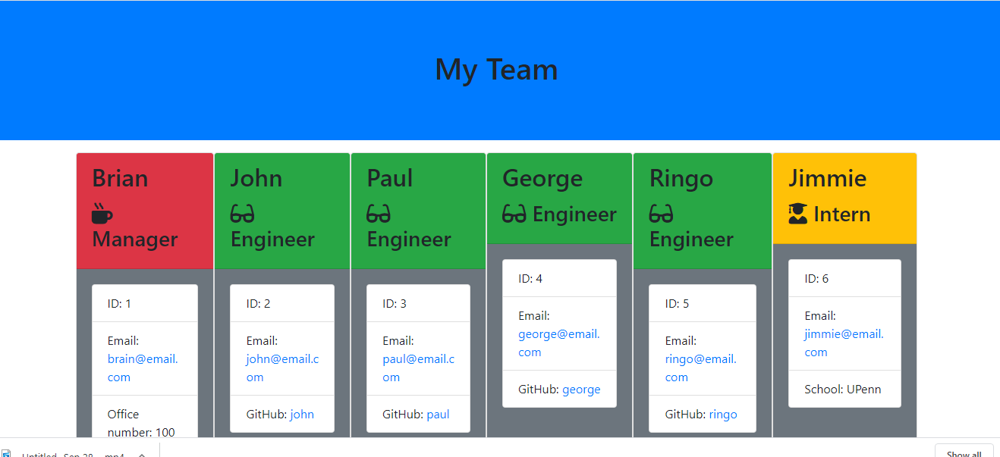

# Team_Profile_Generator

  

  ## Description 
  
  This project is a demo of node.js inquirer method and testing.  It prompts the user for information about individuals on an engineering team and renders a web page displaying cards of information. It also includes some testing code to make sure that each developed piece of the code worked as expected.

  ## Table of Contents

  * [Installation](#installation)
  * [Usage](#usage) 
  * [License](#license)
  * [Contributing](#contributing)
  * [Tests](#tests)
  * [Questions](#questions)
 

  ## Installation 
  
  to run the app from the main folder you must have node.js installed as well as inquirer and jest modules.  Then type node app.js in the command line and follow the prompts.

  ## Usage 
  
  This program can be used to display team members whenever a team is created.  I may use it on Project #2, since we will again be teams.  I might make modifications of the roles to use it in that situation.

  Here is a video to demonstrate how the app is used as well as a picture of the resulting page.  Pardon my levity in using the Fab 4 as the basis for my data.

  Demonstration Video: https://drive.google.com/file/d/120bteNY1LJuXfqyKJRsnbQxEvPWc4XOB/view

  

  ## License 

  This project is licensed under the MIT license.

  Click here for the MIT license: https://choosealicense.com/licenses/mit/

  ## Contributing 
  
  No special guidelines at this time. My thanks, however, to Dave Leonhardt and Vince Gubitosi for their assistance in resolving my jest file issue.

  ## Tests 
  
  The testing files are included in a folder called "test".  You can run them all at once in your command line by typing "npm run test".

  ## Questions 

  Questions or comments about this README.md file? Contact me at dengelberger@gmail.com or visit my GitHub at https://github.com/DEngelberger.

